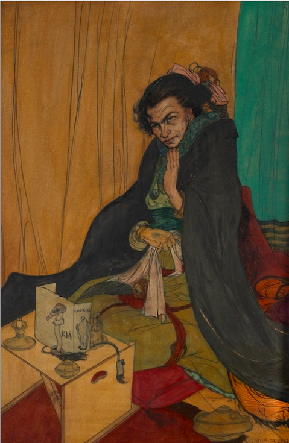

## The Focus of Life（生命の焦点） - Austin Osman Spare 翻訳＋注釈Zine

このZineは、オースティン・オスマン・スペアの『The Focus of Life（生命の焦点）』の全文を、翻訳して注釈をつけたものです。

**by 知られざる呪術師（*Le Sorcier Inconnu*）**  

ディスコーディアン暦3191年 ZosとKiaの祝日第564日曜日  
――手✋と目👁によるクラフトの祝日  

---

 

表紙図版：オースティン・オスマン・スペア《祈り》（1906） 
水彩・不透明水彩・インク／紙   
図版出典：Forum Auctionsカタログより    
非営利学術目的での掲載につき、パブリックドメイン相当またはフェアユースとして扱われている  

---

### 📘 目次

---

### 🔹 APHORISM I: The Mutterings of Aaos（Aaosの独白）
👉[APHORISM I](aphorism01_aaos.md)

>※訳者注：タイトルはAaosの独白ではあるが、冒頭にあるように「文」としてはKia（ただし身代わり人形のKia）がZosに語っている

### 🔹 APHORISM II: The Sexuality and Sleep of Aaos（Aaosの性と眠り）
👉[APHORISM II](aphorism02_sex_sleep.md)

### 🔹 APHORISM III-1: The Butcher of Those Who Follow（従うものの屠殺者）
👉[APHORISM III-1](aphorism03_butcher.md)

>※訳者注：Aphorism III は文量が多いため、構成的便宜により便宜的に3つに分けて整理している。

### 🔹 APHORISM III-2: The Dead Body of Aaos（Aaosの死体）
👉[APHORISM III-2](aphorism04_deadbody.md)

>※訳者注：Aphorism III は文量が多いため、構成的便宜により便宜的に3つに分けて整理している。

### 🔹 APHORISM III-3: The Dream That Came True（夢の成就）
👉[APHORISM III-3](aphorism05_dream.md)

>※訳者注：Aphorism III は文量が多いため、構成的便宜により便宜的に3つに分けて整理している。

---

### 🐌 『生命の焦点（The Focus of Life）』の用語集

本書に登場する象徴的用語の簡易解説と、それぞれの出現箇所の一覧

| 用語       | 定義・解説 | 主な登場Aphorism |
|------------|------------|------------------|
| **Kia**    | 宇宙的潜在力、意志なき意志、純粋な無限存在。Spareにおける最も根源的な原理で、あらゆる形態に先立つ「非存在」。自己の源。 | I, II（暗示）、III-2（暗示） |
| **Zos**    | Spare自身を指す象徴的名称。肉体、自我、意志、性的生命力の統合体であり、魔術実践者としての「私」。 | I, II（ZOS SPEAKS）、III-1（不在） |
| **Ikkah**  | Spareの中に現れる神秘的な声／語り手。おそらくZosの別名的存在で、「自身に語りかける私」。語り手あるいは聴衆として登場。 | I（IKKAH SPEAKS OF HIMSELF）、II（ZOS SPEAKS OF IKKAH）、III-1（IKKAHが語る） |
| **Aaos**   | Zosの変成体、または超越的な自我の姿。預言者的語り手として、快楽・創造・自己超越の視点から語る存在。Kiaに近い存在として描かれることも。 | I（Aaos mutters）、III-2（The Dead Body of Aaos）、III-3（Aaosの夢） |
| **Tzula**  | Aaosの「妹」または「影」として登場する象徴的女性存在。内的対話者であり、欲望や補完の鏡像。 | III-2（回想的に登場） |
| **Arcanum**| 「秘儀」「奥義」「根源的真理」。信念や言語を超えたところにある実在の力。Spareにとっては創造と快楽の中核。 | II（ZosのArcanaとして） |
| **Satyr**  | 古代ギリシア神話に由来する半人半獣の存在。理性に囚われず、欲望と快楽に正直な「真理の担い手」として称揚される。 | III-2（登場） |
| **L.C.O'CS** | 「O L.C.O'CS!」という呼びかけで登場する神秘的対象。愛・欲望・宇宙的霊感（Muse）を象徴する存在と考えられるが詳細不明。 | I（終盤に登場） |
| **Syzygy** | 「自我（I）」と「自己（Self）」が合一する瞬間の象徴。対極の統合、性の合一、天体的整列などのイメージが重なる。 | I（O thou syzygy of my I and Self!） |

---

### 🐌 『生命の焦点（The Focus of Life）』の概要

この文書はは、「Kia（キア）」という目に見えない大きな力から始まる。Kiaは宇宙のすべての源であり、まだ形を持たない存在である。そこには意思も性質もなく、ただ純粋な可能性だけがある。このKiaが世界に現れるとき、「Zos（ゾス）」という名前で肉体を持った存在になる。Zosは人間としての「私」であり、欲望や感覚を通じてこの世界を経験していく。第1章では、ZosがKiaからの声を受け取り、自分の内面を見つめながら、自分という存在について深く考えるようになる。

次に登場するのは、「Ikkah（イッカー）」である。IkkahはZosの中から現れるもう一人の自分のような声で、自分自身に問いかけてくる存在である。Ikkahは「正しさ」や「常識」といった社会のルールを疑い、自分の意志に従って生きることの大切さをZosに教える。第2章では、Zosがこの声に導かれ、他人に決められた生き方ではなく、自分の欲望と信念に基づいた自由な人生を歩もうとする姿が描かれている。

そして物語が進むにつれ、「Aaos（アアオス）」というより高い視点から語る存在が現れる。Aaosは、Zosが成長したあとの姿とも考えられる。彼は、死や再生、夢、快楽といった深いテーマについて語り、人生とはもっと広く、自由で、創造的なものだと伝える。さらに「Tzula（トズラ）」という女性的な存在も現れ、これはAaosの「妹」あるいは「影」のような役割を果たす。第3章では、これまでの問いが一つにつながり、Zosはより深い自己理解へと至る。

---

### 🇬🇧→🇯🇵 翻訳の方針

※本書ではAustin Osman Spareの原文の詩的・断章的文体に合わせ、読者への呼びかけるような口調を用いた。  
また日本語としてはあまり多用しないイタリック体も、本来の意味からズレを生み出すことで、Spareが意図した「認識の撹乱」を表現するための試みである。

---

### 🔖 免責・著作権に関する注意

本Zineは研究・学術・非営利目的で公開されており、出典を明記したうえで原文の部分引用・翻訳を行っています。

----

© 2025 知られざる呪術師（Le Sorcier Inconnu）
本ドキュメントは Creative Commons BY-SA 4.0 に基づき公開されています。

