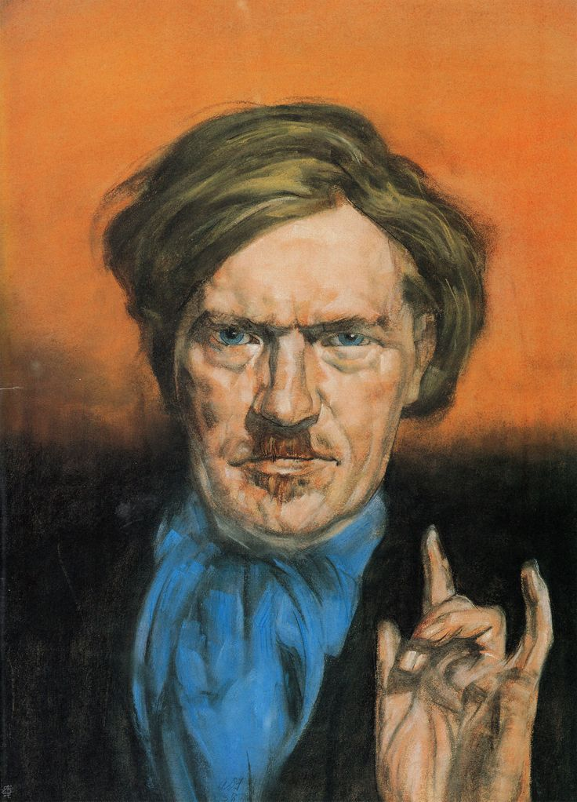

## 『生命の焦点（The Focus of Life）』　- Austin Osman Spare 翻訳＋注釈Zine

このZineは、オースティン・オスマン・スペアの『The Focus of Life（生命の焦点）』の全文を、翻訳して注釈をつけたものです。

**by 知られざる呪術師（*Le Sorcier Inconnu*）**  

ディスコーディアン暦3191年 ZosとKiaの祝日第564日曜日  
――手✋と目👁によるクラフトの祝日  

---

 

表紙画像：Austin Osman Spareによる自画像（出典不詳） 本画像は非営利目的の解釈・批評を目的とし、著作権上のフェアユースまたは日本国著作権法第32条に基づいて使用しています。

---

### 📘 目次

---

### 🔹 APHORISM I: The Mutterings of Aaos（Aaosの独白）
👉[APHORISM I](aphorism01_aaos.md)

>※訳者注：タイトルは（Aaosの独白）ではあるが、冒頭にあるように「文」としてはKia（ただし身代わり人形のKia）がZosに語っている

### 🔹 APHORISM II: The Sexuality and Sleep of Aaos（Aaosの性と眠り）
👉[APHORISM II](aphorism02_sex_sleep.md)

>※訳者注：タイトルは（Aaosの性と眠り）ではあるが、冒頭にあるように「文」としてはZosがIkkahに語っている

### 🔹 APHORISM III-1: The Butcher of Those Who Follow（従うものの屠殺者）
👉[APHORISM III-1](aphorism03_butcher.md)

>※訳者注：Aphorism III は文量が多いため、構成的便宜により便宜的に3つに分けて整理している。

### 🔹 APHORISM III-2: The Dead Body of Aaos（Aaosの死体）
👉[APHORISM III-2](aphorism04_deadbody.md)

>※訳者注：Aphorism III は文量が多いため、構成的便宜により便宜的に3つに分けて整理している。

### 🔹 APHORISM III-3: The Dream That Came True（夢の成就）
👉[APHORISM III-3](aphorism05_dream.md)

>※訳者注：Aphorism III は文量が多いため、構成的便宜により便宜的に3つに分けて整理している。

---

### 🐌 『生命の焦点（The Focus of Life）』の用語集

本書に登場する象徴的用語の簡易解説と、それぞれの出現箇所の一覧

| 語句 | 説明 | 主な登場箇所 |
|------|------|----------------|
| Kia | 宇宙的潜在力、意志なき意志、純粋な無限存在。Spareにおける最も根源的な原理。 | I（冒頭）、III-3（夢の成就） |
| Zos | Spare自身を指す象徴名。肉体・意志・性的生命力の統合体。 | I（Kiaの語り）、II（Ikkahに語る） |
| Ikkah | Zosの内なる神秘的語り手（別名的存在）。 | II（ZosがIkkahに語る）、III-1（Ikkahが主語） |
| Aaos | Zosの変成体。超越的自我であり預言者的語り手。 | III-2（死体）、III-3（夢の成就） |
| Tzula | Aaosの「妹」または「影」として登場。内的対話者的存在。 | III-2（語り相手として） |
| Arcanum | 秘儀・奥義・根源的真理。Zosにおける創造と快楽の中核。 | I（ZosのArcanumとして） |
| Satyr | 理性に囚われぬ欲望の象徴。Spareにとって真理の担い手。 | III-2（挿話） |
| L.C.O'CS | 呼びかけで登場する神秘対象。愛・霊感・欲望の象徴。 | III-1（詩的節） |
| Syzygy | 「I」と「Self」の合一の瞬間。性や統合、天体整列の象徴。 | I（哲学的補足） |
| Zod-Ka | 虚無から顕れた創造的意志を象徴する存在。Ikkahに語る存在としてIII-1に登場。 | III-1（Ikkahに語りかける） |

---

### 🐌 『生命の焦点（The Focus of Life）』の概要

この文書は、「Kia（キア）」という目に見えない大きな力から始まる。Kiaは宇宙のすべての源であり、まだ形を持たない存在である。そこには意思も性質もなく、ただ純粋な可能性だけがある。このKiaが世界に現れるとき、「Zos（ゾス）」という名前で肉体を持った存在になる。Zosは人間としての「私」であり、欲望や感覚を通じてこの世界を経験していく。APHORISM I では、ZosがKiaからの声を受け取り、自分の内面を見つめながら、自分という存在について深く考えるようになる。

次に登場するのは、「Ikkah（イッカー）」である。IkkahはZosの中から現れるもう一人の自分のような声で、自分自身に問いかけてくる存在である。Ikkahは「正しさ」や「常識」といった社会のルールを疑い、自分の意志に従って生きることの大切さをZosに教える。APHORISM II では、Zosがこの声に導かれ、他人に決められた生き方ではなく、自分の欲望と信念に基づいた自由な人生を歩もうとする姿が描かれている。

そして物語が進むにつれ、「Aaos（アアオス）」というより高い視点から語る存在が現れる。Aaosは、Zosが成長したあとの姿とも考えられる。彼は、死や再生、夢、快楽といった深いテーマについて語り、人生とはもっと広く、自由で、創造的なものだと伝える。さらに「Tzula（トズラ）」という女性的な存在も現れ、これはAaosの「妹」あるいは「影」のような役割を果たす。APHORISM III では、これまでの問いが一つにつながり、Zosはより深い自己理解へと至る。

### Austin Osman Spare の主要概念（共通テーマ）

| 番号 | 概念                       | 説明                                                                                                                                       |
|------|----------------------------|------------------------------------------------------------------------------------------------------------------------------------------|
| 1    | 二元論の否定              | Spareは善と悪、聖と俗、夢と現実といった対立的な概念を根本から否定する。現実は主観的で流動的であり、統合的な視点が重要とされる       |
| 2    | 宗教や道徳に対する批判    | 伝統的な宗教や道徳は、自己の意志や快楽を抑圧する「幻想」として否定される。真理は個人の体験から来るものであり、外部の戒律に従うべきではない|
| 3    | 自己愛（Self-love）        | 他者への愛よりも自己への愛を重視し、それを創造の源泉とする。自己愛は進化と変容を促す力であり、禁忌ではなく肯定的に捉えられる        |
| 4    | 快楽と意志の統合         | 快楽は堕落ではなく創造と覚醒の原動力であり、意志と統合されるべきものである。無目的ではなく、自己の統合に向かう意識的行為として扱われる |
| 5    | 自己の多層性と変成        | 「Zos」「Kia」「Aaos」「Ikkah」「Tzula」など、自己は多層的な構造を持ち、変成しうる存在として描かれる。これにより象徴的・神話的な自己理解が可能となる |

---

### 🇬🇧→🇯🇵 翻訳の方針

※本書ではAustin Osman Spareの原文の詩的・断章的文体に合わせ、読者への呼びかけるような口調を用いた。  
また日本語としてはあまり多用しないイタリック体も、本来の意味からズレを生み出すことで、Spareが意図した「認識の撹乱」を表現するための試みである。

---

### 🔖 免責・著作権に関する注意

本Zineは研究・学術・非営利目的で公開されており、出典を明記したうえで原文の部分引用・翻訳を行っています。

----

© 2025 知られざる呪術師（Le Sorcier Inconnu）
本ドキュメントは Creative Commons BY-SA 4.0 に基づき公開されています。

