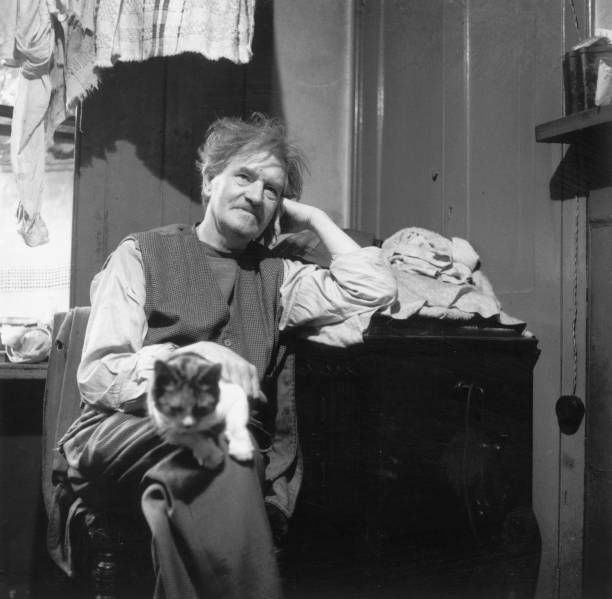

## The Focus of Life（生命の焦点） - Austin Osman Spare 日本語訳プロジェクト（製作中）

このZineは、オースティン・オスマン・スペアの『The Focus of Life（生命の焦点）』の全文を、翻訳したものです。現在は制作途中です。

**by 知られざる呪術師（*Le Sorcier Inconnu*）**  

ディスコーディアン暦3191年 ZosとKiaの祝日第564日曜日  
――手✋と目👁によるクラフトの祝日  

---

 

写真出典：Austin Osman Spare, 撮影年不詳（Public Domain）

---

### 📘 目次（作業中）

---

### 🔹 APHORISM I: The Mutterings of Aaos
[APHORISM I](aphorism01_aaos.md)

### 🔹 APHORISM II: The Sexuality and Sleep of Aaos
[APHORISM II](aphorism02_sex_sleep.md)

### 🔹 APHORISM III-1: The Butcher of Those Who Follow
[APHORISM III-1](aphorism03_butcher.md)

### 🔹 APHORISM III-2: The Dead Body of Aaos
[APHORISM III-2](aphorism04_deadbody.md)

### 🔹 APHORISM III-3: The Dream That Came True
[APHORISM III-3](aphorism05_dream.md)

---
## 🗝️ 『The Focus of Life』用語集（Austin Osman Spare）

本書に登場する象徴的な語・固有名の簡易解説です。いずれもSpareの魔術的思想と詩的文体に即して訳語を決定しています。訳出に際しては、詩性を尊重しつつ、必要に応じて注釈で補います。

---

### 🧍‍♂️ Zos  
Spare自身を指す象徴的名称。肉体、自我、意志、性的生命力の統合体。魔術実践者としての「私」。

### 🌌 Kia  
宇宙的潜在力、意志なき意志、純粋な無限存在。Spareにおける最も根源的な原理で、あらゆる形態に先立つ「非存在」。

### 👁 Aaos  
Zosの変成体、もしくは超越的な自我の姿。預言者的語り手として登場し、快楽・創造・自己超越の視点から語る。

### 🗣 IKKAH  
Spareの中に現れる神秘的な声／語り手。おそらくZosの別名的存在。神秘の一人称として「自身に語りかける私」。

### 🧬 TZULA  
Aaosの「妹」または「影」として登場する象徴的女性存在。内的対話者であり、欲望や補完の鏡像。

### 🔮 Arcanum  
「秘儀」「奥義」「根源的真理」。信念や言語を超えたところにある実在の力。Spareにとっては創造と快楽の中核。

### 🧝‍♂️ Satyr（サテュロス）  
古代ギリシア神話に由来する半人半獣の存在。理性に囚われず、欲望と快楽に正直な「真理の担い手」として称揚される。

### 🪷 L.C.O'CS  
「O L.C.O'CS!」の呼びかけで登場する神秘的対象。愛・欲望・宇宙的霊感（Muse）を象徴する存在と考えられる。詳細不明。

### ♎️ Syzygy（シジジー）  
「自我（I）」と「自己（Self）」が合一する瞬間の象徴。対極の統合、性の合一、天体的整列などのイメージが重なる。

> 📝 各語句の訳語・注釈は文脈に応じて変更の可能性があります。個別のAphorismでは脚注にて詳細に補足します。

---

## 🔖 免責・著作権に関する注意

本Zineは研究・学術・非営利目的で公開されており、出典を明記したうえで原文の部分引用・翻訳を行っています。

----

© 2025 知られざる呪術師（Le Sorcier Inconnu）
本ドキュメントは Creative Commons BY-SA 4.0 に基づき公開されています。

